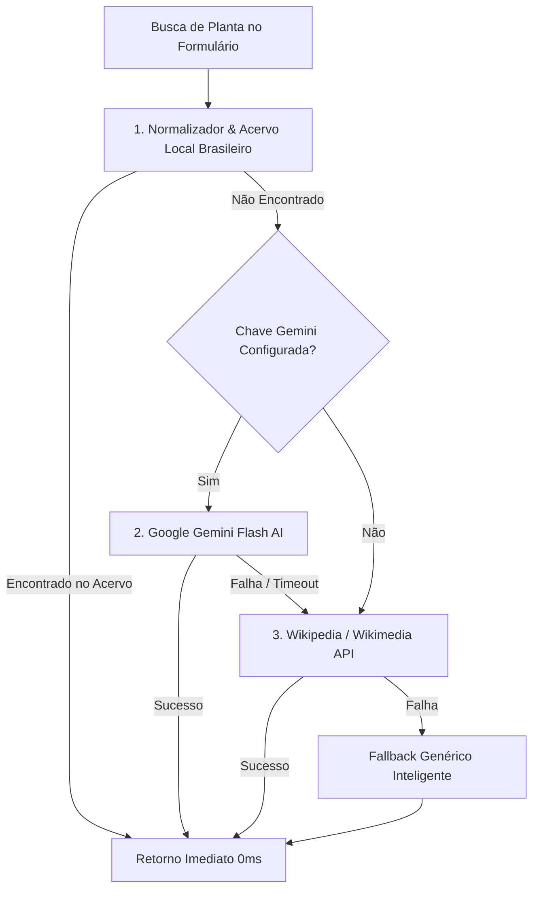

# 🌿 Plano de Arquitetura Botânica & Classificação Híbrida

Documento de arquitetura técnica da migração e evolução do sistema de classificação botânica da aplicação **Tons & Flores**.

---

## 📌 Contexto e Motivação

Anteriormente, o sistema utilizava a API de terceiros (Perenual), que apresentava limitações severas para a realidade de uma loja de plantas no Brasil:
- **Limite rigoroso no plano gratuito:** 100 requisições/dia, com frequentes bloqueios de cota (HTTP 429 *Too Many Requests*).
- **Idioma em inglês:** Exigia traduções e conversões contínuas de termos botânicos.
- **Falta de dados específicos para a flora e cultivo no Brasil:** Dificuldade em classificar nomes populares regionais (*Costela de Adão*, *Jiboia*, *Espada de São Jorge*, *Zamioculca*, etc.).

---

## 🏛️ Nova Arquitetura Híbrida em Camadas (Cascata / Fallback)

O novo motor (`plantClassificationService.ts`) adota uma estratégia multi-camadas que garante **0ms de latência**, custo **100% gratuito** e alta disponibilidade:

---

## 🧩 Componentes do Motor

### 1. Camada 1: Acervo Local Brasileiro (0ms de latência)
- Base de dados botânica com mais de 30 espécies e gêneros comuns no comércio brasileiro.
- Suporte a múltiplos sinônimos (*aliases*) e nomes científicos.
- Preenchimento completo e instantâneo de:
  - Nome popular e científico
  - Família botânica e origem natural
  - Categoria sugerida automática (*Folhagens*, *Suculentas & Cactos*, *Flores*, *Pendentes*, *Arbustos & Árvores*, *Ervas & Temperos*)
  - Necessidade de iluminação (*Sol Pleno*, *Meia Sombra*, *Sombra Difusa*)
  - Frequência de rega e dica prática de irrigação
  - Segurança para animais de estimação (*Pet Friendly*)
  - Ciclo de vida, floração e pragas comuns

### 2. Camada 2: Inteligência Artificial (Google Gemini Flash)
- Geração estruturada em JSON (Schema restrito) com respostas nativas em português brasileiro.
- Análise de toxicidade, substrato e dicas específicas para plantas de interior ou áreas externas.

### 3. Camada 3: Enciclopédia Aberta (Wikipedia / Wikimedia API)
- 100% gratuita, aberta e sem necessidade de chave de API.
- Consulta de nomes científicos, resumos e taxonomia via chamadas CORS diretas pelo navegador.

### 4. Dedução Inteligente de Categorias (`inferCategory`)
- Função heurística que analisa termos de identificação e características botânicas para auto-selecionar a categoria adequada no formulário de cadastro.

---

## ⚡ Vantagens Técnicas
- **Zero KB de dependências pesadas:** Todas as requisições utilizam a API nativa `fetch`.
- **Cache em memória:** Consultas repetidas durante a sessão não geram tráfego de rede.
- **Resiliência:** Mesmo sem conexão externa ou sem chaves de API cadastradas, o sistema continua funcionando normalmente.
