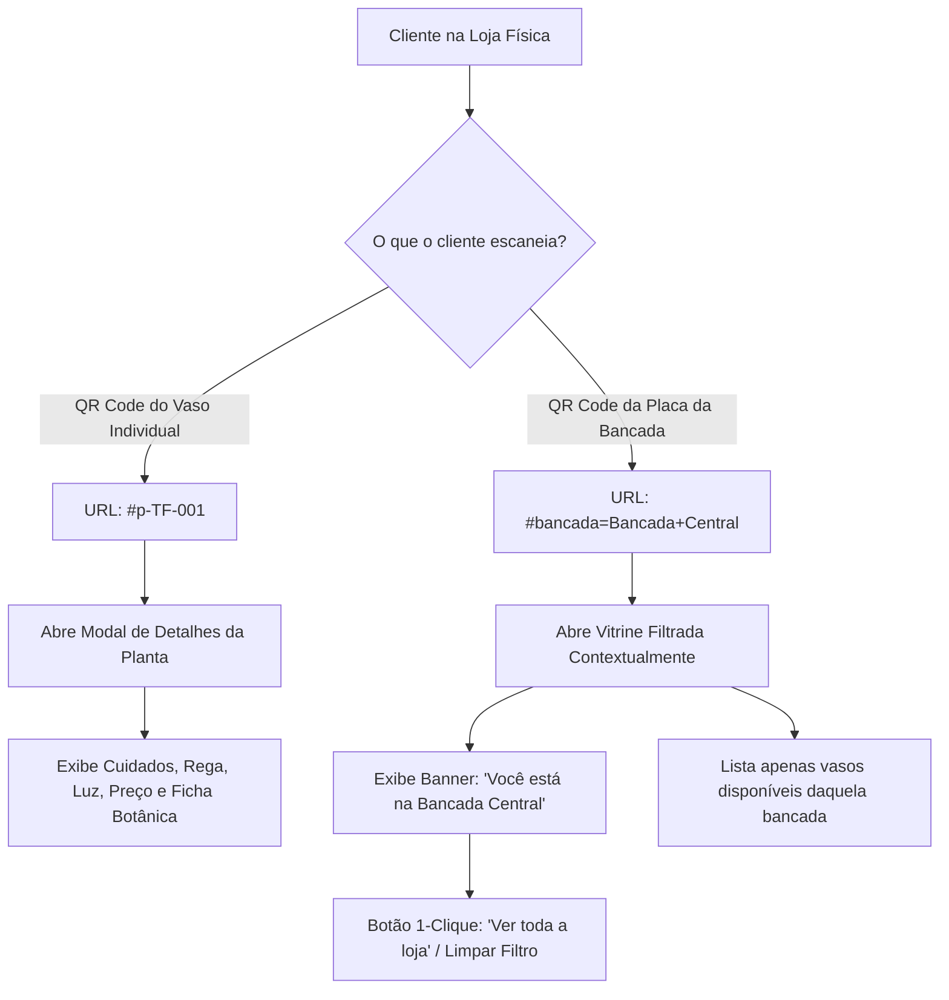

# 📍 Plano de Arquitetura: Etiquetas de Bancadas & Roteamento de Localização

Documento técnico de especificação para o sistema de **Identificação Física por Bancadas / Setores**, **Geração de Placas e Etiquetas com QR Code** e **Roteamento Contextual da Vitrine** para a aplicação **Tons & Flores**.

---

## 📌 Contexto e Objetivos

Na experiência física de uma boutique de plantas, os clientes circulam pelo espaço e observam mesas, estufas e bancadas temáticas. Anteriormente, o sistema contava apenas com etiquetas individuais de vasos (50x30mm).

Este plano estabelece:
1. **Identificação em Dois Níveis:**
   - **Nível 1 (Vaso Individual):** QR Code do vaso específico (`#p-TF-001`) que abre direto a ficha botânica e cuidados.
   - **Nível 2 (Bancada / Setor):** QR Code da mesa/estufa (`#bancada=Bancada+Central`) que abre a vitrine já filtrada com todos os vasos daquele local.
2. **Arquitetura de URLs sem Erro 404:** Uso de *Hash Routing* com compatibilidade total em hospedagens estáticas (GitHub Pages, Vercel, Supabase, etc.).
3. **Padronização de Locais no Cadastro:** Eliminação de erros de digitação (ex: *"Bancada 1"* vs *"bancada 01"*) através de lista gerenciada e autossugestão.
4. **Módulo de Impressão de Placas de Bancada:** Geração de placas no formato Display de Mesa (A5 / 10x15cm) e Faixas Térmicas Niimbot.

---

## 🏛️ Fluxo da Experiência do Cliente e Roteamento



---

## 🌐 Arquitetura de URLs: Por que Hash Routing?

| Abordagem | Exemplo | Vantagens | Desvantagens | Decisão |
| :--- | :--- | :--- | :--- | :--- |
| **Path Routing Tradicional** | `/bancada/central` | URL limpa esteticamente | Retorna **404 Not Found** em recarregamentos (F5) em hospedagens estáticas sem rewrite no servidor. | ❌ Inseguro para SPA estática |
| **Hash Routing (Recomendado)** | `/#bancada=Bancada+Central` | **100% à prova de 404** em qualquer servidor, leitura instantânea no iOS/Android, sem recarregar scripts. | Símbolo `#` na URL | ✅ **Adotado** |
| **Query Parameter** | `/?bancada=Bancada+Central` | URL padrão web | Compatível, mas pode disparar recarregamento completo em alguns navegadores. | Suportado como fallback |

---

## 🎨 Representação Gráfica das Interfaces (Mockups)

### 1. Vitrine ao Escanear QR Code de Bancada (Mobile)
```
┌──────────────────────────────────────────────────────────┐
│  🌿 TONS & FLORES           [ 🌙 Modo Escuro ] [ 🛍️ 12 ] │
├──────────────────────────────────────────────────────────┤
│                                                          │
│  ┌────────────────────────────────────────────────────┐  │
│  │ 📍 VOCÊ ESTÁ NA BANCADA:                           │  │
│  │   Bancada Central • Estufa 01                      │  │
│  │   Exibindo 8 vasos disponíveis nesta bancada       │  │
│  │                                                    │  │
│  │   [ ✕ Ver Todas as Bancadas da Loja ]              │  │
│  └────────────────────────────────────────────────────┘  │
│                                                          │
│  [ 🔍 Pesquisar nesta bancada...                   ]     │
│                                                          │
│  ┌────────────────────┐      ┌────────────────────┐      │
│  │ [ Imagem da Planta ]│      │ [ Imagem da Planta ]│     │
│  │ Costela de Adão    │      │ Ficus Lyrata       │      │
│  │ ☀️ Meia Sombra     │      │ ☀️ Sol Pleno       │      │
│  │ R$ 89,90           │      │ R$ 145,00          │      │
│  │ [ Ver Cuidados ]   │      │ [ Ver Cuidados ]   │      │
│  └────────────────────┘      └────────────────────┘      │
└──────────────────────────────────────────────────────────┘
```

### 2. Filtros Rápidos na Vitrine Geral (Desktop/Mobile)
```
┌─────────────────────────────────────────────────────────────────────────┐
│ [ 🔍 Buscar planta, tag #TF ou espécie...                             ] │
├─────────────────────────────────────────────────────────────────────────┤
│ [ 📍 Bancadas (4) ▾ ]  [ 🌿 Todas as Bancadas ] [ Bancada 01 ] [ Estufa 2 ] │
├─────────────────────────────────────────────────────────────────────────┤
│ [ 🗂️ Categorias ▾ ]    [ Todas (24) ] [ Folhagens ] [ Suculentas ] [ Flores ] │
├─────────────────────────────────────────────────────────────────────────┤
│ [ ⚙️ Cuidados ▾ ]      [ ☀️ Sol Pleno ] [ ⛅ Meia Sombra ] [ 💧 Pouca Rega ] │
└─────────────────────────────────────────────────────────────────────────┘
```

### 3. Painel de Impressão de Etiquetas & Placas (Lojista)
```
┌─────────────────────────────────────────────────────────────────────────┐
│                      IMPRESSÃO & IDENTIFICAÇÃO                          │
│                                                                         │
│  ┌───────────────────────────────┬───────────────────────────────────┐  │
│  │  🏷️ Etiquetas de Vasos (50x30)│  📍 Placas de Bancada (Setores)   │  │
│  │                               │            (Ativa)                │  │
│  └───────────────────────────────┴───────────────────────────────────┘  │
│                                                                         │
│  Selecione a bancada para gerar a placa:                                │
│  [ Bancada Central • Estufa 01 (8 plantas)                       ▾ ]    │
│                                                                         │
│  FORMATO DA PLACA:                                                      │
│  (•) Display de Mesa / Acrílico (A5 / 10x15cm)                          │
│  ( ) Faixa Adesiva de Borda (Térmica Niimbot)                           │
│                                                                         │
│  ┌───────────────────────────────────────────────────────────────────┐  │
│  │                     PRÉ-VISUALIZAÇÃO DA PLACA                     │  │
│  │                                                                   │  │
│  │                       TONS & FLORES                               │  │
│  │                     Boutique de Plantas                           │  │
│  │                                                                   │  │
│  │               🌿 BANCADA CENTRAL • ESTUFA 01                      │  │
│  │                                                                   │  │
│  │                       ┌─────────┐                                 │  │
│  │                       │ █▀▀▀█ █ │                                 │  │
│  │                       │ █ ▀ █ ▀ │                                 │  │
│  │                       │ ▀▀▀▀▀ ▀ │                                 │  │
│  │                       └─────────┘                                 │  │
│  │                 ESCANEIE COM SEU CELULAR                          │  │
│  │        para ver espécies, regas e valores desta bancada           │  │
│  │                                                                   │  │
│  └───────────────────────────────────────────────────────────────────┘  │
│                                                                         │
│  [ 🖨️ Imprimir Placa ]  [ 📥 Baixar Imagem PNG ]                         │
└─────────────────────────────────────────────────────────────────────────┘
```

---

## 🧩 Componentes e Modificações Técnicas

### 1. `services/configService.ts`
- Gerenciamento de lista de Bancadas padrão e customizadas (`getLocations()`, `addLocation()`, `removeLocation()`).
- Persistência em `localStorage` e sincronização com valores existentes nas plantas cadastradas.

### 2. `components/ShowcaseView.tsx`
- Suporte à prop `activeLocationFilter?: string`.
- Banner contextual de boas-vindas da bancada com contagem de vasos e botão de saída rápida.
- Filtro de localização por chips/modal integrado à barra de busca.

### 3. `components/TagsPrintView.tsx`
- Divisão em abas:
  - **Aba 1: Etiquetas de Vasos** (impressão individual térmica 50x30mm e folha A4 em grade).
  - **Aba 2: Placas de Bancadas** (geração de QR Code por bancada, pré-visualização, exportação em PNG alta resolução e impressão direta).

### 4. `components/PlantFormModal.tsx`
- Campo de Localização aprimorado com `<datalist>` e lista suspensa de bancadas ativas da loja, permitindo cadastrar novas com 1 clique.

### 5. `App.tsx`
- Listener unificado de `window.location.hash`:
  - Se hash começa com `#p-`: Abre modal do vaso.
  - Se hash contém `#bancada=` ou `#local=`: Aplica filtro de bancada na vitrine automaticamente.

---

## 📋 Plano de Verificação e Testes

1. **Acesso por QR Code de Bancada:**
   - Acessar `http://localhost:5173/#bancada=Bancada+Central` no navegador desktop e emulado mobile.
   - Confirmar se o banner da bancada aparece com a contagem correta e se apenas as plantas daquele local são listadas.
2. **Transição de Filtro:**
   - Clicar em *"Ver todas as bancadas"* e verificar se a URL é limpa e todos os vasos reaparecem suavemente.
3. **Geração de Placas no Painel:**
   - Acessar o Admin > Etiquetas > Placas de Bancada.
   - Selecionar uma bancada e testar a geração do QR Code SVG e o download do PNG em alta resolução.
4. **Cadastro Padronizado:**
   - Abrir o formulário de cadastro de planta e verificar se as bancadas pré-existentes aparecem como sugestão no campo de localização.
