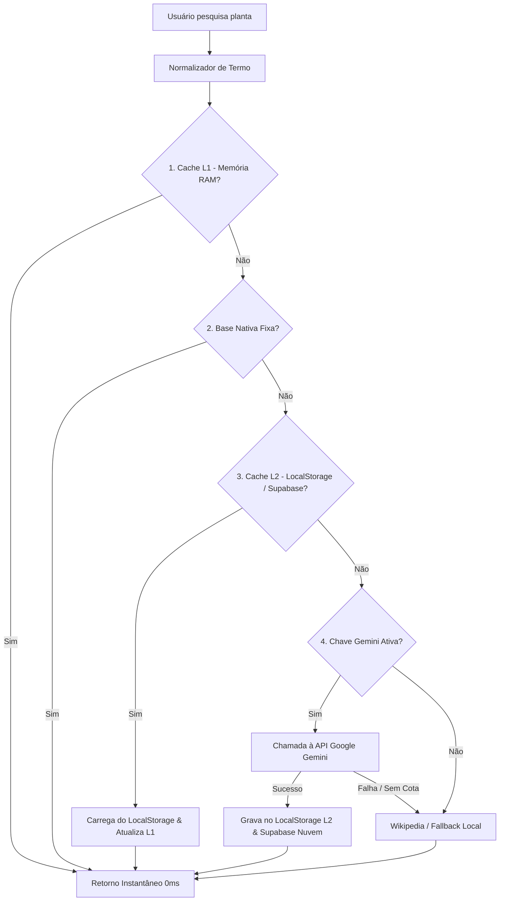

# 💾 Plano de Arquitetura: Persistência & Cache do Acervo Botânico (Gemini AI)

Documento técnico de especificação para armazenamento persistente das classificações botânicas geradas pelo **Google Gemini**, transformando consultas dinâmicas de IA em acervo local permanente para a aplicação **Tons & Flores**.

---

## 📌 Contexto e Objetivos

O sistema atual conta com uma base nativa estática (`BOTANICAL_DATABASE`) e integração com o modelo **Google Gemini** para classificar espécies não cadastradas previamente. No entanto:
- **Ausência de persistência entre sessões:** Consultas realizadas com o Gemini ficam retidas apenas na memória RAM da sessão atual. Ao fechar a aba ou recarregar a página, uma nova consulta ao mesmo termo gastaria tokens e cota da API.
- **Economia de cota e otimização de custos:** Evitar o desperdício de chamadas de rede para espécies que já foram detalhadas com sucesso pela IA.
- **Autonomia e Velocidade:** Tornar o sistema progressivamente mais inteligente — cada nova planta pesquisada é automaticamente incorporada ao acervo do usuário com tempo de resposta de **0ms**.

---

## 🏛️ Arquitetura de Cache em Camadas (Multi-Tier & Cloud Sync)

O motor de classificação evolui para um pipeline híbrido com sincronização em nuvem:



---

## 🧩 Detalhamento dos Níveis de Armazenamento

### 1. Nível L1: Cache em Memória RAM (Sessão Ativa)
- Mantido via estruturas `Map<string, BotanicalSearchResult[]>` e `Map<string, PlantClassificationDetails>`.
- Garante fluidez imediata na digitação do formulário sem operações síncronas de I/O em disco.

### 2. Nível L2: Acervo Persistente Local (`localStorage`)
- Chave de armazenamento: `tons_botanical_custom_cache_v1`.
- Armazena dicionário de espécies classificadas pela IA, indexadas por nomes populares normalizados, nomes científicos e sinônimos (*aliases*).
- Garante que a aplicação funcione mesmo 100% offline.

### 3. Nível L3: Sincronização em Nuvem Multi-Usuário (Supabase)
- **Tabela `botanical_presets` + Tabela `plants`:** Toda planta classificada pelo Gemini ou cadastrada no estoque é salva no Supabase.
- **Compartilhamento Universal:** Quando qualquer administrador consulta o Gemini uma vez, a ficha fica imediatamente disponível para **TODOS os usuários e dispositivos** da loja.

### 4. Nível L4: Base Nativa Estática (`BOTANICAL_DATABASE`)
- Conjunto pré-compilado de alta precisão para as espécies mais vendidas no Brasil (Costela de Adão, Jiboia, Zamioculca, etc.).

### 5. Nível L5: Provedor Generativo Externo (Google Gemini Flash)
- Ativado apenas para termos inéditos nas camadas anteriores.
- Utiliza saída estruturada com JSON Schema para alimentar diretamente o padrão do acervo.
- Utiliza saída estruturada com JSON Schema para alimentar diretamente o padrão do acervo.

---

## 🗄️ Estrutura de Dados do Cache Persistente

Exemplo de registro salvo no `localStorage`:

```json
{
  "calathea orbifolia": {
    "scientific": "Calathea orbifolia",
    "ptName": "Calatéia Orbifolia",
    "family": "Marantaceae",
    "origin": "Bolívia e Florestas Tropicais da América do Sul",
    "suggestedCategory": "Folhagens",
    "light": "sombra-difusa",
    "watering": "frequente",
    "petFriendly": true,
    "wateringTip": "Manter o substrato levemente úmido com água livre de cloro. Não tolerar ar seco.",
    "careInstructions": "Aprecia alta umidade do ar e sombra com luz difusa. Mantenha longe de correntes de ar frio.",
    "cycle": "Perene",
    "bloomingSeason": "Verão",
    "pestsDiseases": "Ácaros e pontas secas por baixa umidade",
    "toxicity": "Não tóxica para animais de estimação (100% Pet Friendly)",
    "aliases": ["maranta orbifolia", "calateia", "orbifolia"],
    "source": "gemini",
    "savedAt": "2026-08-27T20:00:00.000Z"
  }
}
```

---

## 🛠️ Recursos de Gestão e Segurança

1. **Normalização de Chaves:**
   - Remoção de acentuação, caracteres especiais e letras maiúsculas (ex: `Lírio-da-Paz` → `lirio da paz`) para correspondência perfeita.
2. **Tratamento de Cota de Armazenamento:**
   - O armazenamento de textos JSON em `localStorage` consome poucos kilobytes (1.000 espécies ocupam menos de ~500 KB de uma cota de 5 MB a 10 MB).
   - Mecanismo seguro de *try/catch* com fallback gracioso caso o armazenamento do navegador esteja cheio ou bloqueado.
3. **Sincronização com o Catálogo da Loja:**
   - Sempre que uma planta cadastrada na loja tiver ficha técnica completa, seus metadados também enriquecem as sugestões automáticas de busca.

---

## 🎯 Benefícios Esperados

| Métrica | Antes | Com Cache Persistente |
| :--- | :--- | :--- |
| **Consumo de Requisições Gemini** | Repetido a cada sessão | **1 única vez por espécie** |
| **Tempo de resposta (espécie já consultada)** | 800ms ~ 2500ms | **0ms (Instantâneo)** |
| **Disponibilidade Offline** | Apenas base estática | **Base estática + Todas as consultadas** |
| **Custo de infraestrutura** | Risco de estouro de cota | **Custo Zero & Uso Eficiente** |
